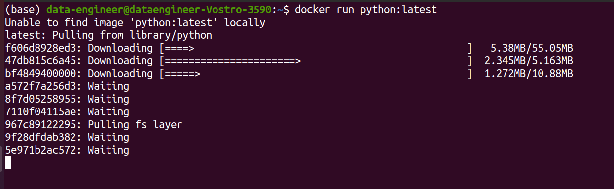
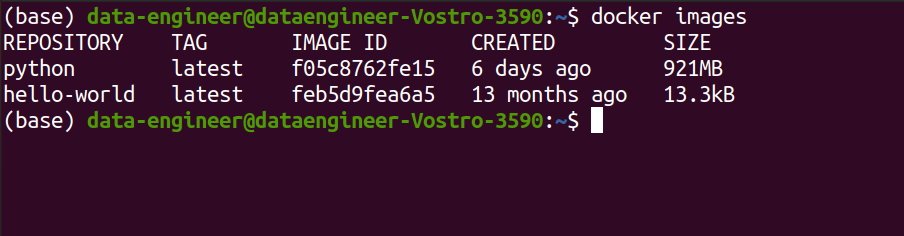
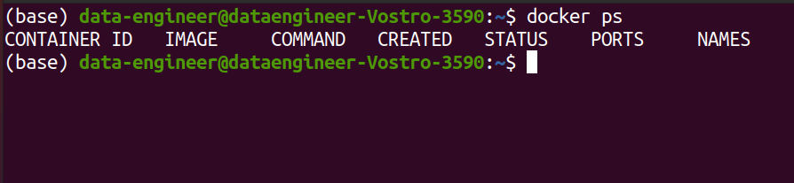
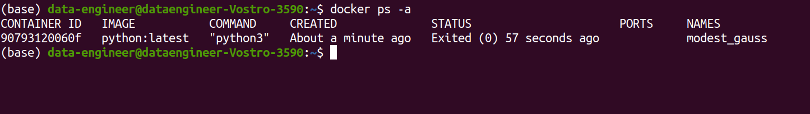
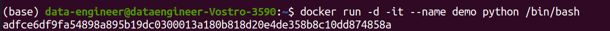
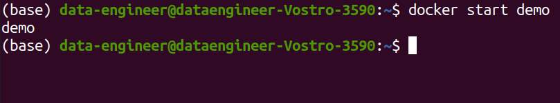
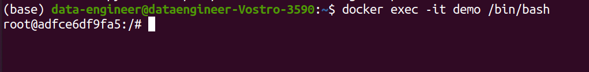

# Docker Tutorial
<p align='justify'>As name suggests this file is all about docker. In this file i will tell you about accessing docker images and containers. So without any further delay let's go.</p>

## Prerequisite
* Basic Knowledge on Docker.
* Basic linux commands.
* Docker setup in your pc

## Docker Commands 

* To pull the image from docker hub
```bash
    docker pull <image name/ID>
            
    docker pull python:latest
```


* To run the image.
```bash
    docker run <image name/ID>
            
    docker run python:latest
```

> But the main difference between pull and run is, **pull** command will **download the image** from docker but **run** will **download the image** from docker hub **and create a container for it**.

* To check the images which is installed in your system
```bash
    docker images
```


* To check the running containers 

```bash
    docker ps
```


* To check all the containers
```bash
    docker ps -a
```


* To run the image
```bash
    docker run -d -p <local_port>:<container_port> <image_name/ID>
                            
    docker run -d -p 8000:80 python
```

* To run the image as a container in a detach mode and interactive mode 
```bash
    docker run -d -it --name <containername/ID> <imagename/ID> /bin/bash
                    
    docker run -d -it --name demo python /bin/bash  
```



* To start a container
```bash
    docker start <containername/ID>
            
    docker start demo
```


* To enter into container 
```bash
    docker exec -it <container name/ID> /bin/bash
                
    docker exec -it demo /bin/bash
```



# To learn more about docker
* [Docker Documentation](https://docs.docker.com/get-started/)


